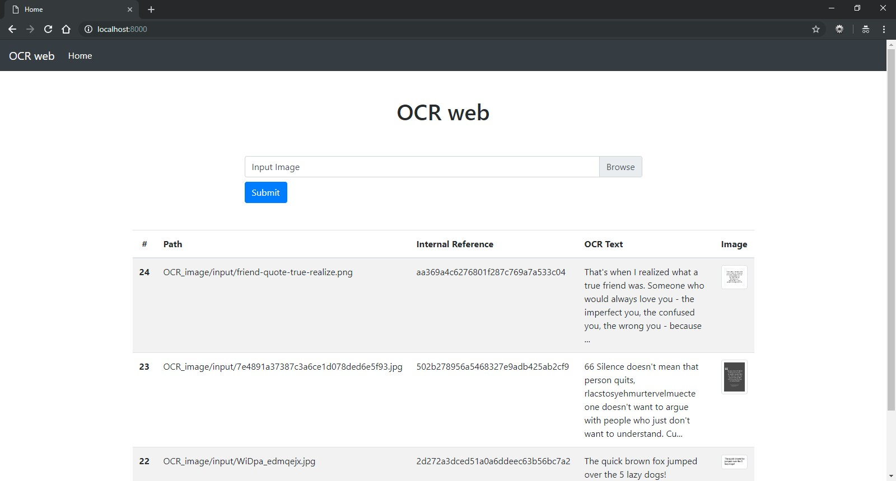
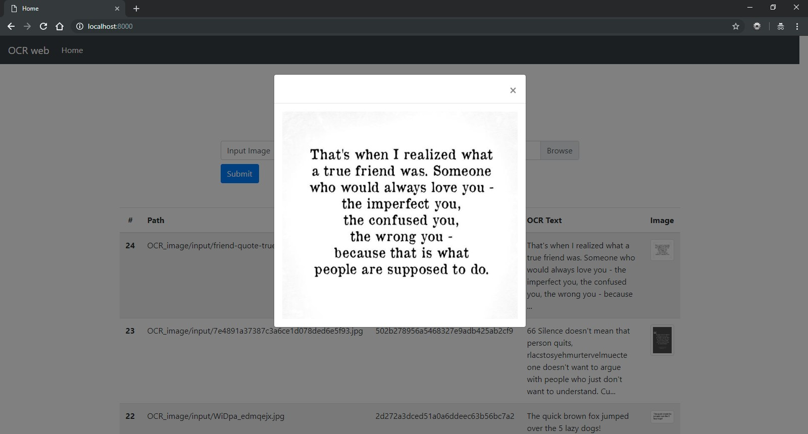

[](https://circleci.com/gh/fabinhojorge/OCR_web)

# OCR web
This project is an OCR (tesseract) web interface to upload images. 


## How to install and Run
After activate your Python Virtual Environment (_venv_) run the below command:

```
pip install -r requirements.txt

python manage.py migrate

python manage.py runserver
```

So you can access in the local URL: _[localhost:8000](localhost:8000/)_


Inside the _requirements.txt_ there are a package called __pytesseract__. 
It´s the wrapper to communicate with the Tesseract library (C/C++ code). 
So, the next step is to install the Tesseract itself. 

For this, please follow the below instructions for your SO:
* [Windows](https://github.com/UB-Mannheim/tesseract/wiki)
* [Mac and Linux](https://github.com/tesseract-ocr/tesseract/wiki)

If an additional language is required, is necessary to download it from [here](https://github.com/tesseract-ocr/tessdata) and move it to $TESSERACT_PATH/tessdata/


## Libraries
* Django
* Pillow
* Bootstrap
* JQuery
* Tesseract (pytesseract)
* Celery


## Screen Shots

__Home Page__


__Image Zoom__

